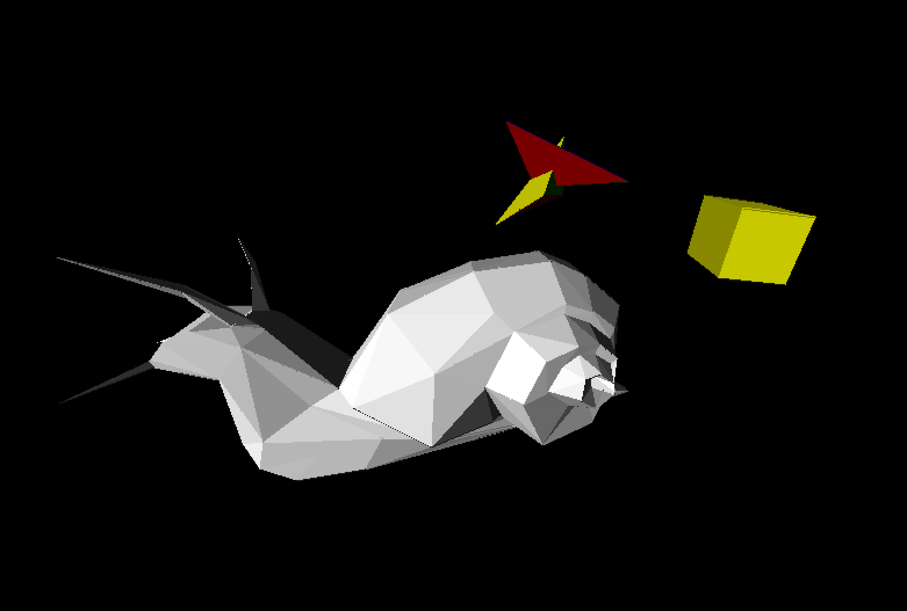
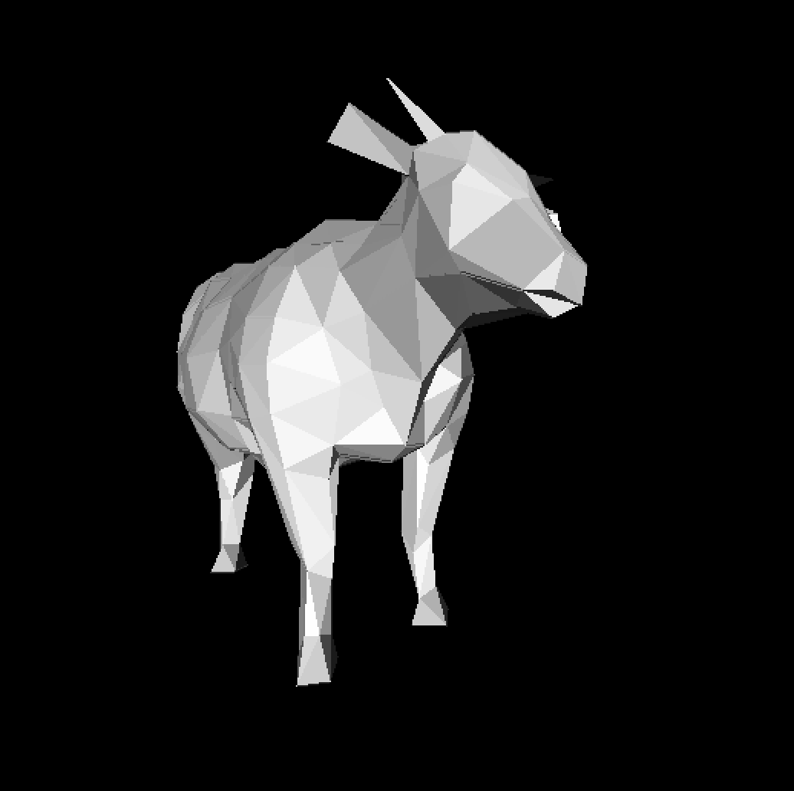
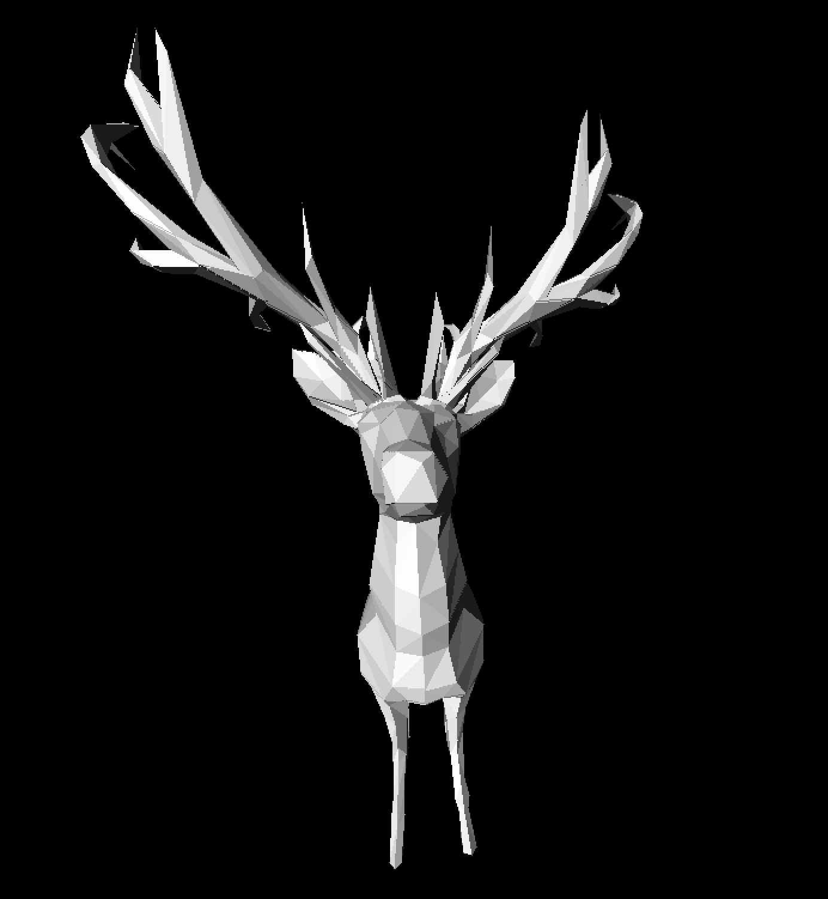

# 3D-Renderer

## Cборка и запуск:

```
mkdir build
cd build
cmake ..
make
./3D-Renderer
```

## Управление:

### Перемещение камеры: 
стрелки
F C (вперед - назад)
### Вращение камеры: 
A D (относительно вертикальной оси камеры)
W S (относительно горизонтальной оси камеры)
Q E (относительно перпендикулярной оси камеры)
### Вращение света: 
J L (относительно вертикальной оси)
I K (относительно горизонтальной оси)
### Изменение интенсивности света:
Y H

## Отсупление:
B `main.cpp` код, который рисует импортированную из snail.obj улитку (смоделировала в blender), 2 пересекающихся разноцветных тетраэдра и куб.


### Еще модельки разных животных:

